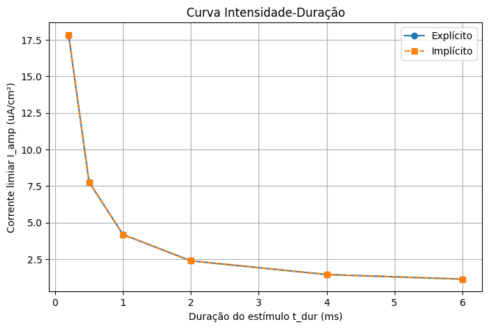
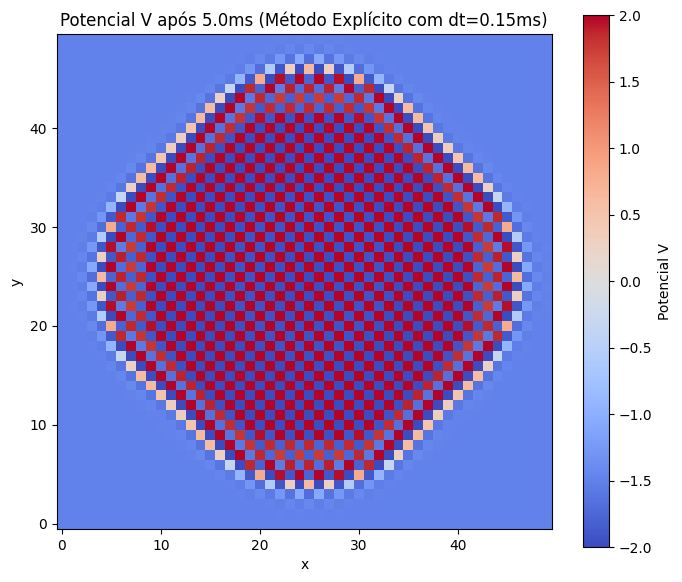

# CardioPy

[](https://opensource.org/licenses/Apache-2.0)
[](https://www.python.org/downloads/)
[](https://jupyter.org/)

A computational model of cardiac tissue electrophysiology using the FitzHugh-Nagumo (FHN) reaction-diffusion system. This project simulates wave propagation in 2D myocardial tissue and investigates the relationship between electrical stimulus parameters and the initiation of self-sustaining excitation waves.


## Overview

Cardiac tissue is an electrically active medium where action potentials—rapid depolarization followed by repolarization—drive rhythmic contraction. Understanding how electrical stimuli initiate self-sustaining waves is crucial for studying defibrillation, arrhythmias, and pacemaker design.

This project models cardiac tissue as a 2D continuous medium governed by a reaction-diffusion partial differential equation (PDE) using the **FitzHugh-Nagumo** model—a simplified two-variable system that captures essential excitable dynamics:

- Existence of an excitation threshold
- "All-or-nothing" behavior
- Wave propagation through diffusive coupling

## Key Questions

**What is the relationship between stimulus intensity (I_amp) and duration (t_dur) required to trigger a self-sustaining propagating wave in 2D cardiac tissue?**

## Model Description

### Cellular Dynamics: FitzHugh-Nagumo

The FHN model describes each point in the tissue with two variables:

- **V**: Membrane potential (fast, excitatory variable)
- **w**: Recovery variable (slow, inhibitory variable)

$$
\frac{\partial V}{\partial t} = V - \frac{V^3}{3} - w + I_{stim}
$$

$$
\frac{\partial w}{\partial t} = \epsilon (V + \beta - \gamma w)
$$

**Parameters:**
- $\epsilon$: Recovery rate (typically 0.01 - 0.1)
- $\beta$: Polarization parameter
- $\gamma$: Recovery parameter

### Spatial Coupling: Reaction-Diffusion

Using the **monodomain approximation**, the complete system is:

$$
\frac{\partial V}{\partial t} = D \nabla^2 V + \underbrace{\left( V - \frac{V^3}{3} - w + I_{stim} \right)}_{\text{reaction term (FHN)}}
$$

$$
\frac{\partial w}{\partial t} = \epsilon (V + \beta - \gamma w)
$$

where:
- $D$: Diffusion coefficient (electrical conductivity)
- $I_{stim}$: Applied stimulus current (non-zero only during the pulse)

### Numerical Methods

**Spatial Discretization:** 5-point finite difference Laplacian with Neumann (zero-flux) boundary conditions using reflected ghost nodes.

**Temporal Integration:** Operator splitting with two approaches:

| Method | Update | Stability | Performance |
|--------|--------|-----------|-------------|
| **Explicit (Euler Forward)** | $V^{n+1} = V^n + \Delta t \cdot D \nabla^2 V^n$ | Conditional (CFL: $\Delta t \le \Delta x^2 / 4D$) | Fast per step, many steps needed |
| **Implicit (Crank-Nicolson)** | $(I - \frac{\Delta t D}{2}\nabla^2) V^{n+1} = (I + \frac{\Delta t D}{2}\nabla^2) V^n$ | Unconditional | Slower per step, fewer steps |

## Results

### Strength-Duration Curve



The strength-duration relationship follows the Lapicque/Weiss equation:

$$
I_{amp} = \frac{R}{1 - e^{-t_{dur} / \tau}}
$$

**Physiological Parameters Derived:**
- **Reobase (R)**: ~1.133 μA/cm² (minimum current for infinite duration)
- **Chronaxia (t_c)**: ~2.250 ms (time needed at 2× reobase)

### Numerical Method Comparison

| Method | Precision | Avg. CPU Time (s) | Stability |
|--------|-----------|-------------------|-----------|
| **Explicit** | Reference | ~7.3 | Conditional (requires $\Delta t = 0.02$ ms) |
| **Implicit (Crank-Nicolson)** | Nearly identical | ~16.3 | Unconditional |

The implicit method is ~2.2× slower for this grid size but enables larger time steps for finer meshes.

### Stability Analysis

When the explicit method violates the CFL condition ($\Delta t > \Delta x^2/4D$), numerical instabilities manifest as "checkerboard" patterns with unphysical oscillations between ±2 in adjacent pixels.



## Getting Started

### Prerequisites

```bash
Python 3.8+
```

### Installation

1. Clone the repository:
```bash
git clone https://github.com/yourusername/CardioPy.git
cd CardioPy
```

2. Install dependencies:
```bash
pip install -r requirements.txt
```

3. Launch the Jupyter notebook:
```bash
jupyter notebook notebooks/Complete_Notebook.ipynb
```

### Dependencies

- NumPy
- SciPy (sparse matrices, linear solvers)
- Matplotlib
- Jupyter Notebook

## Code Structure

```
cardiac-modeling/
├── README.md
├── requirements.txt
├── LICENSE
├── notebooks/
│   └── Complete_Notebook.ipynb
├── src/
│   ├── __init__.py
│   ├── fhn_model.py      # FHN derivatives and cellular dynamics
│   ├── diffusion.py      # Laplacian operator and diffusion solvers
│   ├── stimulus.py       # Stimulus application
│   └── simulation.py     # Main simulation functions
├── tests/
│   ├── test_fhn.py
│   ├── test_diffusion.py
│   └── test_simulation.py
└── images/
    ├── strength_duration_curve.png
    ├── propagation_animation.gif
    └── stability_test.png
```

### Key Functions

```python
# FHN cellular dynamics
def FHN_derivatives(V, w, I_stim, epsilon=0.01, beta=0.7, gamma=0.8):
    """Calculate FHN derivatives"""
    dVdt = V - (V**3)/3 - w + I_stim
    dwdt = epsilon * (V + beta - gamma * w)
    return dVdt, dwdt

# Diffusion operator (Neumann boundary conditions)
def apply_laplacian(V, dx):
    """2D Laplacian with zero-flux boundary"""
    # Reflected ghost node implementation
    ...

# Implicit solver with LU factorization caching
def implicit_diffusion_solver(V, dx, dt, D, theta=0.5):
    """Crank-Nicolson diffusion solver with cached LU decomposition"""
    ...

# Parameter sweep
def find_threshold(t_dur, metodo='explicito', tol=0.1):
    """Find threshold current using binary search"""
    ...
```

## Performance Optimizations

The implicit solver uses **LU factorization caching** to avoid rebuilding and refactoring the sparse matrix at each time step—since the matrix depends only on grid parameters ($N_x, N_y, dx, dt, D$), not the solution itself.

```python
_cache_implicito = {}

def implicit_diffusion_solver(V, dx, dt, D, theta=0.5):
    key = (Nx, Ny, dx, dt, D, theta)
    if key not in _implicit_cache:
        L = _build_2d_laplacian_operator(Nx, Ny, dx)
        I = identity(N, format='csc')
        A = (I - theta * dt * D * L).tocsc()
        M = (I + (1 - theta) * dt * D * L).tocsc()
        lu = splu(A)
        _implicit_cache[key] = (M, lu)

    M, lu = _implicit_cache[key]
    # Solve using cached factorization
```

**Memory/Performance Trade-off:**
- **Explicit**: Scales as $O(N^2)$ in time steps due to CFL restriction
- **implicit**: Scales as $O(N^{1.5})$ due to LU fill-in but maintains constant time steps


## References

- FitzHugh, R. (1961). Impulses and physiological states in theoretical models of nerve membrane. *Biophysical Journal*, 1(6), 445-466.
- Nagumo, J., Arimoto, S., & Yoshizawa, S. (1962). An active pulse transmission line simulating nerve axon. *Proceedings of the IRE*, 50(10), 2061-2070.
- Aliev, R. R., & Panfilov, A. V. (1996). A simple two-variable model of cardiac excitation. *Chaos, Solitons & Fractals*, 7(3), 293-301.
- Clayton, R. H., Bernus, O., Cherry, E. M., et al. (2011). Models of cardiac tissue electrophysiology: progress, challenges and open questions. *Progress in Biophysics and Molecular Biology*, 104(1-3), 22-48.

## License

This project is licensed under the Apache License, Version 2.0 - see the LICENSE file for details.


## Acknowledgments

- This project was developed as part of a **Dynamical Systems Modeling** course
- Special thanks to Ronny Calixto for guidance
